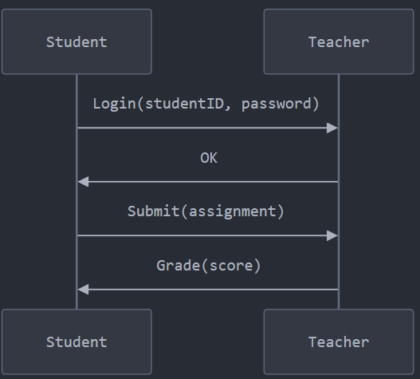

# Dolev_yao_model_protocol

# Student Teacher Protocol

Student sends their credentials to teacher for authentication
Teacher responds with OK
Student submit an assignment to teacher
Teacher evalutes the assignment and send back Grade to student

What assets are being protected?
    Student's login credentials
    Assignment content
    Grades
    Student's identity

Trust Assumptions:
    The channel between student and teacher is reliable
    The password proves student's identity
    Only the teacher can assign grades

The possible attacks
Replay Attacks: Attacker can capture and resend old assignments
Authentication Attacks: Password is sent in plaintext
Message Attacks: Attacker can intercept and modify assignments

How to secure this protocol:
Add Basic Security: Hash passwords instead of plaintext, Add timestamps to messages
Improve Authentication: Include nonces (random numbers)
Protect Messages: Encrypt sensitive data

